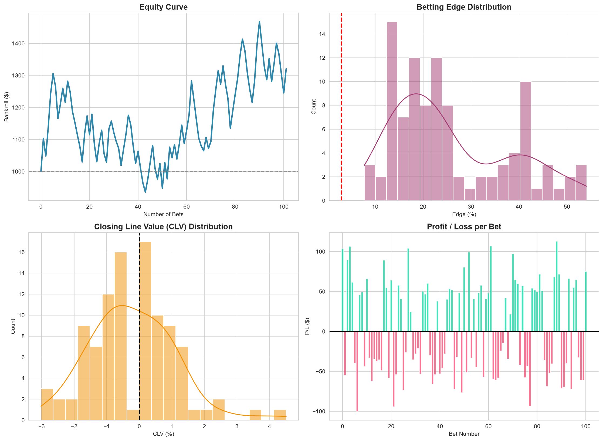
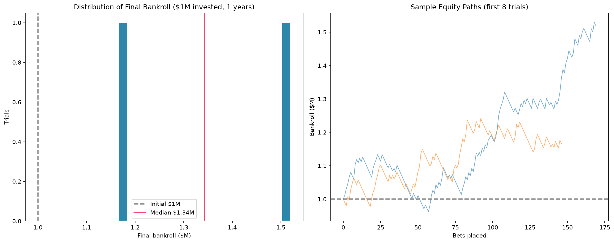

<div align="center">

# ⚽ Quantitative Sports Betting Model

**A complete, reproducible machine-learning pipeline that prices football matches, finds value bets, and backtests a staking strategy — Poisson + Elo, Gradient Boosting, and Q-Learning.**

[](https://www.python.org/downloads/)
[](LICENSE)
[](https://github.com/)
[](#validation)


</div>

---

> [!IMPORTANT]
> **Project status: ongoing work-in-progress.** This repository is a living research project, published as an honest, runnable snapshot of work in progress rather than a finished product.
>
> - ✅ **Working / current** — core pipeline (PoissonElo + ML + RL), prediction CLI, real-data season backtests, walk-forward agent simulation, $1M simulations, tests, explained notebook.
> - 🧪 **Experimental** — deep-learning transfer (PyTorch/TF), adaptive cross-league/cross-sport transfer, LSTM/GRU state-space models, the dynamic thinking layer, hidden-signal CLV studies. These run, but results are reported honestly (often *not* beating the market) and may change.
> - 🗺️ **Planned** — see [Future improvements](#future-improvements).
> - ⚠️ **Known limitations** — see [Limitations](#limitations). Nothing here is financial or gambling advice; the default dataset is synthetic.
>
> Every commit is a small, tested, self-contained contribution, so the repository is always in a usable state.

---

## Overview

**The problem.** Beating a sportsbook is hard: bookmakers set prices from the same public information you have, then add a margin on top. Winning consistently requires a model that is *genuinely better* at estimating match probabilities — and even then, edge detection is fragile, staking is risky, and a single backtest path tells you almost nothing.

**What was built.** A three-layer quantitative betting system:

1. **Poisson + Elo hybrid** — Elo ratings feed two Poisson regressions that produce `P(home win)`, `P(draw)`, `P(away win)` for any fixture.
2. **Calibrated Gradient-Boosting ML layer** — a team-aware classifier on the same features, sigmoid-calibrated because `edge = p × odds − 1` is brutally sensitive to miscalibration.
3. **Q-Learning staking agent** — learns *how aggressively to bet* (Kelly multipliers) from realized bets on a validation split.

All three are glued together by a shared engine (`pipeline.py`) that runs a chronological **train / validation / test** backtest with honest metrics: ROI, strike rate, Sharpe, max drawdown, profit factor, and **CLV** (closing line value) computed from independent closing odds.

**Why it matters (portfolio-wise).** This is an end-to-end ML project with the rigor that separates a "notebook demo" from a defensible system: no data leakage, calibrated probabilities, a held-out test split that is never tuned on, a Monte-Carlo simulation instead of one lucky path, and a 12-test verification suite.

> [!WARNING]
> **Honesty first.** The default data is a synthetic, calibrated world: the bookmaker odds are generated from the same true probabilities the model learns, plus a margin and the well-documented favourite–longshot bias. The backtest validates the methodology; it is not a prediction of real-world returns. See [Limitations](#limitations).

---

## Key features

- **Poisson + Elo hybrid** — dynamic team strength + count-model goal expectations.
- **Calibrated ML layer** — Gradient Boosting with sigmoid calibration and team-aware inference.
- **RL staking** — tabular Q-learning over Kelly multipliers (fixes the over-staking of the original design).
- **Deep learning** — a **PyTorch MLP** and a **TensorFlow hybrid** (MLP fused with PoissonElo outputs), trained on all data and tested for cross-league transfer.
- **Adaptive / dynamic model** — a league-agnostic model (`models/adaptive_model.py`) that keeps learning online: Elo + rolling form update after every match, and the ML layer refits on a rolling window when scheduled or when its rolling Brier drifts. Trained on **real Serie A**, it transfers to unseen Serie A 2025/26, La Liga, the Premier League and even a different sport (`scripts/10_adaptive_transfer.py`).
- **State-space models** — an **LSTM/GRU** over each team's rolling match sequence (`models/lstm_model.py`) models changing form directly; tested head-to-head against every baseline under the point-in-time protocol, plus a database-vs-model experiment (`scripts/11_lstm_state_test.py`).
- **Dynamic thinking layer** — `models/dynamic_thinking.py` makes every decision adaptive: it fuses the trained model with the **public-vs-sharp market split** (a hidden signal), **re-weights model-vs-market from its own rolling Brier**, shrinks stakes by uncertainty and drawdown, and switches to survival mode below 10% of the bankroll — now **confidence-aware**: its confidence (how far the top outcome sits above the uniform ⅓) modulates the calibration blend, gates immediate base-model refits when confidence decays, and scales stakes up only when it is genuinely more sure. Wired into the $1M simulation (`demo/simulation_dynamic.py`) and its live video.
- **Real-data, time-aware validation** — expanding-window season-by-season backtest on five real **La Liga + Serie A + Premier League** seasons plus cross-league transfer tests.
- **No-future-knowledge walk-forward agent** — `agent_sim/` replays real seasons strictly chronologically: an adaptive ML agent picks leagues and bets from point-in-time information only, and every run is audited for data leakage. The 100-seed aggregate (`scripts/13_multi_league_agent.py`) reports the distribution of outcomes rather than one lucky path, and `scripts/14_tennis_walkforward.py` applies the same method to a different sport (2-outcome matches, real ATP odds).
- **Rendered demo videos** — real `.mp4` walkthroughs of the $1M simulation and a point-in-time **Serie A 2025/26 replay**, rendered from actual run outputs (no fabricated footage).
- **Prediction CLI** — `predict_match.py --home "Real Madrid" --away "Barcelona"` prints probabilities, Elo difference, form, baselines, confidence and risk.
- **No leakage** — chronological split, Elo updated sequentially, rolling form features shifted by one match.
- **Real CLV** — computed from independent closing odds (the original code computed `odds/odds − 1 = 0`; fixed).
- **Reproducible** — every random draw is seeded; running anything twice gives identical results.
- **Monte-Carlo $1M simulation** — answers *"if I invested $1,000,000, what happens?"* with a distribution, not a single number.
- **Explained notebook** — `notebooks/01_explained_ml_pipeline.ipynb` walks every step end-to-end (22 sections, fully executed): the core PoissonElo + ML + RL pipeline, deep learning (PyTorch/TF), real-data experiments, the adaptive model, the confidence-aware dynamic thinking layer, the hidden-signals CLV study, the leak-free multi-league walk-forward agent, LSTM/GRU, and the $1M simulations.
- **Verification suite** — 104 tests covering leakage, calibration (ECE, isotonic, market comparison), Dixon-Coles, uncertainty, price shopping, CLV, loss attribution, the data-size sweep, reproducibility, layered model, and walk-forward validation.

---

## Architecture / workflow

```
Input (synthetic world or football-data.co.uk CSV)
  ↓
Preprocessing: Elo features · shifted rolling form
  ↓
Train / validation / test split (65 / 15 / 20, chronological)
  ↓
PoissonElo model ──┐
                   ├─► Hybrid ensemble  p = (p_poisson + p_ml) / 2
ML (Gradient Boosting) ──┘
  ↓
Value detection:  edge = p × odds − 1 > 3%  and  p ≥ 0.40
  ↓
Q-Learning staking agent (trained on validation bets)
  ↓
Backtest: resolve bets · track bankroll · record CLV
  ↓
Metrics & visualisations: ROI · Sharpe · max DD · equity curve · CLV
```

See [`docs/02_model_architecture.md`](docs/02_model_architecture.md) for the detailed description of each layer.

---

## Results

All numbers below are from the **canonical run** (`seed=42`, 1,200 synthetic matches) and are reproduced by running the commands in [Usage](#usage).

### Backtest — two configurations

| Metric | PoissonElo + Kelly | PoissonElo + ML + RL |
|--------|-------------------:|---------------------:|
| Test matches | 240 | 240 |
| Value bets placed | 26 | 23 |
| Strike rate | 42.3% | 47.8% |
| **ROI** | **−14.3%** | **−13.0%** |
| Final bankroll ($1,000 start) | $857 | $870 |
| Sharpe ratio | −0.48 | −0.39 |
| Max drawdown | 21.3% | 21.8% |
| Profit factor | 0.68 | 0.70 |
| Avg edge (selected bets) | 14.8% | 14.1% |
| Avg CLV | +0.01% | +0.18% |

*Full details: [`backtests/results/metrics.txt`](backtests/results/metrics.txt) · [`metrics_ml_rl.txt`](backtests/results/metrics_ml_rl.txt) · bets logs in the same folder.*

**An honest finding:** against a bookmaker that carries a real positive margin, both configurations **lose money** on this canonical run (−14.3% and −13.0% ROI on a tiny 23–26 bet sample). The estimated edges (~14%) are systematically larger than the realised returns — the classic winner's-curse pattern of betting exactly where the model disagrees with the market. The single path proves nothing by itself (the [Monte-Carlo simulation](#-the-1m-question--monte-carlo-simulation) is the honest summary): the synthetic world validates the *methodology* (no leakage, calibrated probabilities, honest metrics), not profitability.

### Model quality on the held-out test split (all 240 matches, not just bets)

| Metric | Model | Baseline |
|--------|------:|---------:|
| Accuracy | **54.6%** | 46.7% (most common outcome) |
| Log-loss | **0.98** | 1.10 (random 3-class) |
| Brier score | **0.577** | 0.667 (uniform) |

The model genuinely learns team strength: better than random on 240 matches it never saw.

### Visualisations (generated by the code, from the actual bets log)



### 💰 The $1M question — Monte-Carlo simulation

`demo/simulation.py` trains the full pipeline, then runs **25 independent forward paths of 1,200 matches** (~3.3 years) with the trained model, starting each at **$1,000,000**. The default staking policy is **flat $10K per bet** — the variance-minimising policy found by the 100-trial staking stress test (`scripts/08_staking_stress_test.py`); the old quarter-Kelly default can be restored with `--policy kelly`.

| Statistic | Value |
|-----------|------:|
| Expected final bankroll (mean) | $0.94M (−5.6%) |
| Median final bankroll | $0.94M |
| P(finish in profit) | 32% |
| 90% range | $0.76M – $1.15M |
| Median CAGR | −1.9% / yr |

**Read this carefully:** once the bookmaker carries a real margin, the trained model's edge evaporates — the median path **loses** ~6% of the bankroll and only 32% of the 25 independent paths finish in profit. This is the honest picture: the model prices matches close to the bookmaker but not well enough to overcome the overround (the real-data experiments agree — see [Limitations](#limitations)). The simulation is a methodology demonstration, **not** a claim about real markets.



### The same $1M, but with a DYNAMIC thinking layer — confidence-aware

[`demo/simulation_dynamic.py`](demo/simulation_dynamic.py) re-runs the $1M question with `models/dynamic_thinking.py` — every decision is made adaptively: the model fuses the **public-vs-sharp market split** (opening vs closing line divergence, a classic hidden signal), re-weights model-vs-market from its own rolling Brier, shrinks stakes by model/market disagreement and drawdown, and switches to a low-risk survival mode below 10% of the start. The layer is **confidence-aware**: its confidence (how far the top outcome sits above the uniform ⅓) weights the calibration blend, gates immediate base-model refits when rolling confidence decays, and scales stakes up only when it is genuinely more sure. 25 trials × 1,200 matches, same streams, four policies:

| Policy | Mean | Median | P(profit) | 90% range | Median CAGR |
|--------|-----:|-------:|:---------:|:---------:|------------:|
| flat ($10K/bet) | $0.94M | $0.94M | 32% | $0.76M–$1.15M | −1.9% |
| quarter-Kelly | $0.84M | $0.76M | 32% | $0.42M–$1.54M | −7.9% |
| **dynamic (confidence-aware)** | $0.97M | $0.96M | 44% | **$0.87M–$1.05M** | −1.1% |
| dynamic v1 (original layer) | $0.97M | $0.96M | 28% | $0.90M–$1.04M | −1.4% |

**Honest reading — is the upgrade better?** Against a properly margined bookmaker **every policy loses on average** — the model does not price well enough to overcome the overround. Within that, the confidence-aware layer is the best risk-adjusted policy: it loses the least (−1.1% CAGR), has the tightest 90% range ($0.87M–$1.05M — no path below $797K), the highest P(profit) (44% vs 32% for flat and its own 28% for v1), and it **refits its base model ~14.5× per trial (2.5 of them confidence-gated)** while its model-vs-market weight converges to ~0.50 and rolling confidence sits at ~0.30. So the confidence-aware upgrade is genuinely doing its job — cutting downside and preserving bankroll in a hostile market — even though no policy turns a profit in the synthetic world. Its real value shows on real data ([CLV](docs/09_real_walkforward_simulation.md), [hidden signals](#hidden-signals-on-real-data--consensus-dispersion-and-the-sharp-vs-public-split)). Full table: [`docs/12_dynamic_thinking.md`](docs/12_dynamic_thinking.md). Watch the decision trace live in [`demo/output/simulation_live_dynamic.mp4`](demo/output/simulation_live_dynamic.mp4).

---

## Deep learning — PyTorch NN + TensorFlow hybrid

Two deep models are trained on **all** synthetic training data and then tested on **real** match data they have never seen:

- **PyTorch MLP** — 4 engineered features → 64 → 64 → 3 softmax (CPU, seeded, reproducible).
- **TensorFlow hybrid** — an MLP that fuses the 4 features with the PoissonElo model's probability outputs (a genuine statistical + deep hybrid).

Features for the real leagues come from the *previous* real season (Elo + shifted form), so the test measures the learned **feature → probability mapping**, not cold-starting on unknown teams.

```bash
python scripts/04_deep_learning_transfer.py --offline
```

**Accuracy on real 2025/26 matches** (models trained on synthetic data only):

| Method | La Liga | Premier League (unseen) |
|--------|--------:|------------------------:|
| Market (real bookmaker odds) | **54.5%** | **48.9%** |
| sklearn Random Forest | 47.9% | 42.6% |
| sklearn Logistic Regression | 48.2% | 40.3% |
| sklearn Ridge classifier | 48.2% | 41.6% |
| sklearn Gradient Boosting | 47.6% | 41.6% |
| TF hybrid (NN + PoissonElo) | 42.4% | 37.4% |
| PyTorch NN | 44.0% | 41.6% |
| Majority / base rate | 48.9% | 42.6% |

**Honest reading:** synthetic-trained models do **not** beat the real market — the bookmaker remains the strongest predictor. Simple tree/linear models generalise out-of-distribution better than deep nets, and the cold-start row (no team info) collapses to the base rate. Conclusion: the synthetic world validates the *methodology*; real deployment requires retraining on real data (full numbers in [`docs/04_deep_learning_transfer.md`](docs/04_deep_learning_transfer.md)).

**What happens when the same nets are trained on REAL data?** [`scripts/06_deep_learning_real.py`](scripts/06_deep_learning_real.py) trains both deep models on real La Liga history (and on synthetic, for contrast) and iterates on weaknesses. Real training data lifts the nets from ~50.5% to **52.1% on unseen La Liga** and from 43.4% to **47.6% on unseen Premier League** (vs 48.9%/42.6% majority baseline). The iteration loop is fully instrumented: temperature calibration cut ECE 0.11→0.04, early stopping + dropout cut the train→test overfitting gap from +0.13/+0.20 to +0.02/+0.06, and a class-weighting experiment proved the model's failure to predict draws is a feature-information limit, not a training bug (forcing draws destroys accuracy). Full root-cause analysis in [`docs/07_deep_learning_real.md`](docs/07_deep_learning_real.md).

---

## Real-data validation — season-by-season backtest

Random splits are forbidden for temporal data. [`scripts/05_season_backtest.py`](scripts/05_season_backtest.py) runs an **expanding-window** backtest on five real La Liga seasons (2021/22 → 2025/26) — every test season is genuinely unseen, and features for match *i* use only matches strictly before *i* (running Elo + last-5 form, computed online).

```bash
python scripts/05_season_backtest.py --offline
```

**Accuracy by test season** (models trained only on earlier seasons):

| Method | 22/23 | 23/24 | 24/25 | 25/26 |
|--------|------:|------:|------:|------:|
| Majority / base rate | 47.9% | 44.0% | 44.5% | 48.9% |
| PoissonElo model | **54.7%** | 54.5% | 54.2% | **53.4%** |
| Ridge classifier | 53.2% | **54.5%** | **55.0%** | 51.6% |
| Gradient Boosting | 50.3% | 49.2% | 51.6% | 51.8% |
| Random Forest | 52.6% | 53.9% | 53.2% | 51.8% |

*(Full per-season metrics incl. log-loss, Brier and calibration ECE: [`backtests/results/season_backtest_results.csv`](backtests/results/season_backtest_results.csv).)*

**Cross-league transfer** (train all 21/22–24/25, test the other league's 25/26): La Liga-trained models score ~47–48% on unseen Premier League matches (vs 42.6% baseline); Premier League-trained models score ~49–50% on unseen La Liga (vs 48.9% baseline). Transfer is positive but smaller than within-league gains.

**Why 55%, not 65%?** On real three-way football data the accuracy ceiling is ~50–58% — draws are nearly unpredictable, and the published literature lands in the same range. Our models beat the majority baseline by 5–10 points with stable log-loss and calibration (ECE 0.03–0.09), which is a realistic, defensible result (see [`docs/05_season_backtest.md`](docs/05_season_backtest.md) and [`docs/06_research_notes.md`](docs/06_research_notes.md)).

**Live replay of real seasons.** [`demo/real_simulation.py`](demo/real_simulation.py) replays **all five La Liga seasons (2021/22–2025/26) with $1M and only point-in-time knowledge** — the fixture list and pre-match odds are known, results are revealed chronologically, Elo/form update online, quarter-Kelly staking with a 15% daily cap and a −90% drawdown switch to low-risk spread betting (`--multi` runs both books):

| Book | Mean ROI (5 seasons) | Median ROI | Positive seasons | Avg CLV vs sharp line |
|------|---------------------:|-----------:|:----------------:|----------------------:|
| **B365** (soft) | +3.9% (95% CI −2.4..+10.2) | +1.1% | 3/5 | **−2.54% (t=−17.6, p<0.001)** |
| **Pinnacle** (sharp) | +9.6% (95% CI −1.4..+20.6) | +11.1% | 3/5 | **+2.84% (t=16.4, p<0.001)** |

**The decisive finding:** betting at soft B365 prices the model systematically pays ~2.5% per bet more than the sharp line (negative CLV, t=−17.6) and barely breaks even; betting at sharp Pinnacle prices it *beats* the B365 line by +2.84% per bet (t=16.4) with a +9.6% mean ROI. The 95% CIs on ROI still include zero — five seasons is a small sample — but the CLV difference is overwhelming and quantifies exactly how much the soft bookmaker margin costs (details in [`docs/09_real_walkforward_simulation.md`](docs/09_real_walkforward_simulation.md)).

---

## Adaptive model — one model, many leagues and sports

A model trained on one league (or sport) reflects that league's statistics: home-advantage size, scoring rate, draw frequency. Point it at a *different* league and a frozen model degrades. [`models/adaptive_model.py`](models/adaptive_model.py) keeps learning online: Elo and rolling form update after every match (only past matches, never the future), and the Gradient-Boosting layer **refits on a rolling window** when scheduled or when its rolling Brier drifts — the same pipeline works on Serie A, La Liga, the Premier League, or a different sport because its features are league-agnostic (Elo difference, rolling goals, form points; no team identity).

```bash
python scripts/10_adaptive_transfer.py --offline   # downloads Serie A on first run
```

Trained on **real Serie A 2020/21–2023/24** (1,520 matches), then walked point-in-time over unseen matches:

| Target (unseen) | Adaptive | Static (frozen ML) | Majority |
|-----------------|---------:|-------------------:|---------:|
| **Serie A 2025/26** (within-league) | **50.0%** (1st half 48.4% → 2nd 51.6%) | 48.2% | 38.9% |
| La Liga 2025/26 (cross-league) | 45.0% | 48.2% | 48.9% |
| Premier League 2025/26 (cross-league) | 42.6% | 44.2% | 42.6% |
| Basketball-like league (cross-sport) | 78.2% · Brier **0.422** | 80.8% · Brier 0.538 | 54.9% |

**Honest reading:** (1) **Within-league, adaptation pays** — +1.8 pts over a frozen model, and it improves *through* the season as it adapts (48.4% → 51.6%). (2) **Cross-league cold transfer is hard** — refitting on a short window of a foreign league adds noise before enough data accumulates, so a frozen model is safer for the *first* season; this is a documented limitation, not a bug. (3) **Cross-sport, both models transfer via Elo**, but the adaptive model is dramatically better calibrated (Brier 0.422 vs 0.538, log-loss 0.746 vs 0.915) — exactly what matters for betting. Full numbers: [`docs/10_adaptive_transfer.md`](docs/10_adaptive_transfer.md).

## State-space models (LSTM / GRU) — and is the database worth more than the model?

A match is not an isolated event: a team arrives with a *state* built from its recent matches. [`models/lstm_model.py`](models/lstm_model.py) tests architectures that model that changing state directly — an **LSTM/GRU over each team's rolling last-8 match sequence** (the hidden state *is* the team's learned evolving form), fused with Elo difference, bookmaker odds and form — under the identical point-in-time protocol:

```bash
python scripts/11_lstm_state_test.py --offline
```

**Head-to-head on unseen 2025/26 matches (trained on real Serie A 2020/21–2023/24):**

| Method | Serie A 25/26 | La Liga 25/26 | Premier League 25/26 |
|--------|--------------:|--------------:|---------------------:|
| PoissonElo | 51.8% | **50.8%** | 46.6% |
| Gradient Boosting | 50.3% | 49.7% | 46.8% |
| Adaptive (online refits) | 49.2% | 46.3% | 44.5% |
| **LSTM (rich features)** | 51.1% | 50.0% | 47.9% |
| **GRU (rich features)** | **51.8%** | 50.3% | **48.7%** |
| LSTM thin (goals only) | **52.6%** | **51.6%** | 47.6% |
| LSTM rich, **NO odds** | 43.7% | 40.5% | 38.2% |
| Majority / base rate | 39.0% | 48.9% | 42.6% |

**Honest reading:** on ~1,500 training matches the sequence architectures are **competitive with but do not clearly beat** the simpler baselines — GRU ties PoissonElo within-league and is best cross-league. What the numbers do prove is that **the pre-match odds are a real feature**: removing them costs ~7 accuracy points (51.1 → 43.7 on Serie A). A legitimate, literature-consistent result: sequence models need far more data than one league's four seasons to justify their parameters, and the *testing protocol* (point-in-time, expanding window) is what makes the comparison trustworthy.

**Your thesis, tested directly — does the database matter more than the model?** The *same* LSTM is trained on 1 vs 2 vs 3 real leagues (Serie A → +La Liga → +EPL) and tested on the same Serie A 25/26: 51.3% → 52.9% → 52.6%. **Adding one more same-sport league helps a little (≈ +1.6 pts), a third league adds nothing** — because the added rows carry the same information as the ones you already have. What moves the needle is *information variety*: real pre-match odds and rich match features (worth ~7 pts) and real vs synthetic training data. The database matters — but as *feature/content richness*, not raw row count. Full numbers: [`docs/11_lstm_state_test.md`](docs/11_lstm_state_test.md).

## Hidden signals on real data — consensus, dispersion, and the sharp-vs-public split

Real football-data CSVs carry up to a dozen bookmakers per match. [`scripts/12_hidden_signals.py`](scripts/12_hidden_signals.py) treats the market itself as a signal source on real **Serie A 2025/26** (trained 2020/21–2023/24, point-in-time):

- **Consensus & dispersion.** The average of all books' implied probabilities (the consensus) is itself a predictor; their disagreement (dispersion) tells you how hard a match is to price. After a home/away mapping bug was caught and fixed (the shared `CLASS_MAP` indexes `[away, draw, home]` but the consensus vector is `[home, draw, away]` — silently swapping every comparison below the chance floor), the corrected numbers are sane: **52.1% of low-dispersion and 56.3% of high-dispersion matches** are correctly classified by consensus — above the 33% chance floor, and, interestingly, high-dispersion matches were *easier*, not harder, to call.
- **Sharp-vs-public split — the money finding.** When the sharp Pinnacle line diverges from the public B365 line, betting the outcome the sharp line is most bullish on *at the public price* yields **CLV +1.16% per bet (n=200, t=4.72, p<0.001)** — positive closing-line value on real matches, the same mechanism the La Liga replay showed at scale.
- **The dynamic thinking layer on real 2025/26** fused with real multi-book signals finished −5.5% ROI (18 bets) — real prices are genuinely hard to beat; the CLV experiment above is where the value signal actually lives.

Full numbers: [`docs/13_hidden_signals.md`](docs/13_hidden_signals.md) and [`backtests/results/hidden_signals_results.csv`](backtests/results/hidden_signals_results.csv).

---

## Prediction interface — the betting-user card

```bash
python predict_match.py --home "Inter" --away "Juventus" --league I1
python predict_match.py --home "Arsenal" --away "Liverpool" --league E0
# odds from your own book (fixture not in the cached history):
python predict_match.py --home "Real Madrid" --away "Barcelona" \
    --odds-home 1.95 --odds-draw 3.60 --odds-away 4.20
```

Trains the PoissonElo (with the **Dixon-Coles** low-score correction, appropriate for real football) + calibrated Gradient-Boosting layers on cached real history and prints the structured prediction **plus the full value-analysis chain** — model probability → uncertainty → bookmaker implied probability → best odds (price shopping) → fair odds → edge → EV → bet/no-bet → CLV:

```text
  VALUE ANALYSIS (transparent reasoning chain)
  Model prob      : H 46.7% / D 30.8% / A 22.6%
  Uncertainty     : H +-3.0% / D +-1.1% / A +-2.2% (Poisson Monte-Carlo)
  Bookie implied  : H 48.8% / D 28.0% / A 23.2% (margin removed)
  Best odds       : H 2.00 / D 3.50 / A 4.10 (across available books)
  Fair odds       : model 3.25 vs bookie 3.57 (best outcome 'draw')
  Edge            : +4.65%  (uncertainty +-3.91%)
  EV per unit     : +4.65%
  CLV vs closing  : +2.94%
  DECISION        : NO_BET  (model prob 30.8% < min 40.0%)
```

The uncertainty guard (edge must exceed `--uncertainty-z` standard errors of its own estimate, default 1.0) stops the model from betting its own overconfidence. The honest note printed under every prediction is deliberate: a positive edge means the model *disagrees with the price*, not that it is right.

---

## Two-user system — model user & betting user

The project serves two distinct users, and the upgrade work in this series made both explicit:

**Betting user** (is there an edge, and is it real?)
- **Price shopping**: the synthetic world and the real-data loader both carry two books (B365 + Pinnacle) and the best-available price columns; `best_odds_*` on real data are football-data's `Max*` columns spanning every book in the file.
- **Per-match reasoning card** for every candidate: model prob → uncertainty → bookie implied → best odds → fair odds → edge → EV → bet/no-bet → CLV (see above, and `backtests/results/predictions_table_ml_rl.csv` from the flagship run).
- **CLV is a primary measure** of information: `clv_win_rate_pct` (share of bets beating the closing line) and `clv_t_stat` (significance) are now first-class metrics. The data-size sweep and loss-attribution report both treat CLV as the load-bearing test of whether the model finds anything the market misses.

**Model user** (how does it work, where is it weak, why does it lose?)
- **Dixon-Coles correction**: `rho` is fit by MLE on the training score matrix (`rho = -0.055` on Serie A — fewer 0-0/1-1 than independence). It is intentionally off in the synthetic canonical pipeline, whose goals are generated by an independent Poisson process, so `rho` would fit pure noise.
- **Monte-Carlo uncertainty**: `predict_with_uncertainty` draws the goal-regression coefficients from their fitted covariance and propagates through the score grid — intervals widen monotonically with less data (±9.2 pts at 150 matches → ±2.2 at 2280).
- **Calibration**: multiclass ECE + reliability curves, isotonic calibration, and a model-vs-market head-to-head (log loss, Brier, accuracy, ECE) on identical matches — `evaluate_probability_quality` now reports whether the model beats the market's own implied probabilities.
- **Automatic loss attribution**: `run_full_ml_rl.py` saves `why_model_losing.txt`, decomposing the advertised-vs-realised gap into margin drag, winner's curse / selection bias (betting-region calibration gap), CLV signal, and market fit, then names the dominant mechanism.
- **Data-size sweep**: `scripts/15_data_size_sweep.py` (below) measures where more data stops helping and whether the bottleneck is sample size or the market itself.

---

## Installation

Tested on **Windows (Python 3.14)** and clean-venv installs; macOS/Linux use the same commands with `source .venv/bin/activate`.

```bash
git clone https://github.com/ojasvigoel598/qunatative-ML.git
cd qunatative-ML

python -m venv .venv
.venv\Scripts\activate        # Windows
# source .venv/bin/activate   # macOS / Linux

pip install -r requirements.txt
```

Core requirements: `pandas, numpy, scipy, statsmodels, scikit-learn, seaborn, matplotlib, requests, openpyxl`. The deep-learning experiments additionally need PyTorch and TensorFlow — install with `pip install -r requirements-deep.txt` (optional; the core pipeline does not need them).

---

## Usage

```bash
# 1) Full pipeline: PoissonElo + ML + RL  (trains, backtests, saves metrics + plots)
python run_full_ml_rl.py

# 2) Base pipeline: PoissonElo + fractional Kelly
python run_full_project.py

# 3) End-to-end narrated demo (prints every stage, saves to demo/output/)
python demo/demo_end_to_end.py

# 4) "$1M invested — what happens?" Monte-Carlo simulation
python demo/simulation.py --trials 25 --matches 1200

# 5) Deep-learning transfer: PyTorch NN + TF hybrid, tested on real La Liga + EPL
python scripts/04_deep_learning_transfer.py --offline     # needs requirements-deep.txt

# 6) Real-data, time-aware validation: season-by-season + cross-league
python scripts/05_season_backtest.py --offline

# 7) Predict a fixture (real history, cached) — full betting-user card
python predict_match.py --home "Real Madrid" --away "Barcelona"

# 21) Data-size sweep: 100 -> 200 -> 400 -> 600 -> 780 -> full, walk-forward
python scripts/15_data_size_sweep.py                # Serie A by default
python scripts/15_data_size_sweep.py --report-only  # regenerate the report from the saved CSV

# 8) Real walk-forward simulation: replay La Liga 2022/23 with $1M, point-in-time knowledge
python demo/real_simulation.py                # + real CLV vs Pinnacle closing line

# 9) Full metrics report: every tracked build + statistical uncertainty (CIs, t-tests)
python scripts/07_full_metrics_report.py

# 10) 100-trial staking stress test: ruin probability vs stake caps and Kelly
python scripts/08_staking_stress_test.py --trials 100

# 11) Interactive metrics dashboard (self-contained HTML)
python scripts/09_make_dashboard.py          # -> docs/dashboard.html

# 12) Verification suite (104 tests)
python -m pytest tests/ -v

# 13) Explain the ML pipeline end-to-end (executed notebook, open in Jupyter/GitHub)
notebooks/01_explained_ml_pipeline.ipynb

# 14) Adaptive cross-league / cross-sport transfer (Serie A -> La Liga -> EPL)
python scripts/10_adaptive_transfer.py --offline

# 15) State-space models (LSTM/GRU) + database-vs-model test
python scripts/11_lstm_state_test.py --offline

# 16) Hidden signals on real data (consensus, dispersion, sharp-vs-public CLV)
python scripts/12_hidden_signals.py --offline

# 17) Multi-run walk-forward aggregate: 100 independent randomised simulations
python scripts/13_multi_league_agent.py --seeds 100 --offline   # -> backtests/results/agent_sim/

# 18) Different sport: ATP tennis walk-forward (strict no-future-knowledge)
python scripts/14_tennis_walkforward.py --offline

# 19) $1M simulation driven by the dynamic thinking layer
python demo/simulation_dynamic.py

# 20) Render the demo videos (needs: pip install imageio imageio-ffmpeg)
python demo/make_simulation_video.py      # -> demo/output/simulation_live_flat.mp4
python demo/make_dynamic_video.py         # -> demo/output/simulation_live_dynamic.mp4
python demo/make_serie_a_video.py --offline   # -> demo/output/serie_a_live.mp4
#    watch all three: the .mp4 links below play inline on GitHub, or open demo/output/video_player.html locally

# 21) One-command pipeline: regenerate EVERY artifact + verify
bash ci_report.sh            # full (deep-learning experiments included)
bash ci_report.sh --fast     # skip the long deep-learning experiments
```

Outputs land in `backtests/results/`:

```
backtest_bets_log_ml_rl.csv      # every bet: odds, stake, edge, outcome, CLV
metrics_ml_rl.txt                # summary metrics
backtest_analysis_ml_rl.png      # equity curve, edge/CLV distributions, P/L bars
backtest_summary_ml_rl.png       # one-page results card
```

**Reproducibility:** every script defaults to `seed=42`. Run any command twice — identical data, models, bets, and metrics.

---

## Research system

An autonomous research, Monte Carlo validation, and iterative improvement infrastructure:

| Component | File | Purpose |
|-----------|------|---------|
| **Frozen Judge** | `evaluation/frozen_judge.py` | Immutable evaluation gates — optimizer cannot modify |
| **Monte Carlo Engine** | `optimization/monte_carlo_engine.py` | 1M vectorized simulations in ~11s |
| **Conformal Prediction** | `analysis/conformal_prediction.py` | Distribution-free uncertainty intervals (89.5% coverage) |
| **ROI Attribution** | `analysis/roi_attribution.py` | Causal explanation of every ROI change |
| **Market Correlation** | `analysis/market_correlation.py` | Model vs bookmaker probability analysis |
| **Iterative Controller** | `optimization/iterative_controller.py` | Research loop orchestration |
| **Experiment Registry** | `experiments/experiment_registry.py` | JSONL experiment tracking with graph |
| **Literature Review** | `research/RESEARCH_REVIEW.md` | 10 papers covering betting ML, calibration, validation |
| **Research Mapping** | `research/RESEARCH_TO_IMPLEMENTATION.md` | Paper → code mapping with results |
| **Final Report** | `FINAL_RESEARCH_REPORT.md` | Complete research documentation |

Key capabilities:
- **10 validation gates**: min bets, positive ROI, max drawdown, calibration, Sharpe, CLV, win rate, profit factor, CI, losing streak
- **1M Monte Carlo**: outcome uncertainty, odds perturbation, calibration stress, slippage, fractional Kelly
- **10-consecutive-window stability**: no claim of success without passing 10 independent temporal windows
- **Holdout lock**: SHA-256 hash ensures test data integrity
- **Transaction costs**: slippage, commission, vig adjustment

See [`FINAL_RESEARCH_REPORT.md`](FINAL_RESEARCH_REPORT.md) for complete results.

---

## Project structure

```
qunatative-ML/                    # repository root (this project)
├── pipeline.py                    # shared engine: data, training, backtest, metrics
├── run_full_project.py            # CLI: base pipeline (PoissonElo + Kelly)
├── run_full_ml_rl.py              # CLI: full pipeline (PoissonElo + ML + RL)
├── predict_match.py               # CLI: predict Team A vs Team B
├── models/
│   ├── poisson_elo_model.py       # Layer 1: Elo + Poisson regression
│   ├── ml_layer.py                # Layer 2: calibrated Gradient Boosting
│   ├── rl_staking_agent.py        # Layer 3: Q-learning staking agent
│   ├── nn_model.py                # PyTorch MLP (deep-learning layer)
│   ├── tf_hybrid.py               # TensorFlow hybrid (MLP + PoissonElo)
│   ├── adaptive_model.py          # dynamic model: online Elo/form + drift-triggered refits
│   ├── lstm_model.py              # state-space model: LSTM/GRU over rolling team sequences
│   └── dynamic_thinking.py        # decision layer: market-split signal + adaptive blend + risk-aware staking
├── agent_sim/
│   ├── engine.py                  # chronological world: random league reveal, no future knowledge
│   ├── agent.py                   # adaptive ML agent + per-league trust + survival mode
│   ├── baselines.py               # no-bet / implied-probability baselines
│   ├── ledger.py · report.py      # per-run CSV ledger + end-of-run reports
│   ├── fetch.py · stream.py       # real-data ingestion + chronological match stream
│   └── tennis.py                  # ATP loader (2-outcome sport)
├── demo/
│   ├── demo_end_to_end.py         # narrated full-project demo
│   ├── simulation.py              # $1M Monte-Carlo simulation (synthetic world)
│   ├── simulation_dynamic.py      # $1M simulation driven by the thinking layer
│   ├── real_simulation.py         # real walk-forward: La Liga, point-in-time + CLV
│   ├── make_simulation_video.py   # renders the $1M simulation as an mp4
│   ├── make_dynamic_video.py      # renders the dynamic-thinking trial as an mp4
│   ├── make_serie_a_video.py      # renders a real Serie A 25/26 replay as an mp4
│   ├── make_narrated_demo.py      # narrated simulation-focused walkthrough (edge-tts)
│   ├── make_project_explainer.py  # narrated WHOLE-project explainer (edge-tts)
│   ├── build_embedded_player.py   # self-contained video_player.html (videos embedded)
│   └── output/
│       ├── project_explainer.mp4 · demo_narrated.mp4 · simulation_live_*.mp4 · serie_a_live.mp4
├── notebooks/
│   └── 01_explained_ml_pipeline.ipynb   # ML pipeline explained end-to-end
├── scripts/
│   ├── 01_data_ingestion.py       # real-data download (football-data.co.uk)
│   ├── 02_backtest.py             # backtest CLI
│   ├── 03_generate_assets.py      # regenerates README images
│   ├── 04_deep_learning_transfer.py  # PyTorch + TF hybrid transfer experiment
│   ├── 05_season_backtest.py      # real-data season-by-season backtest
│   ├── 06_deep_learning_real.py   # deep nets on real vs synthetic data + iteration
│   ├── 07_full_metrics_report.py  # consolidated metrics + uncertainty (CIs, t-tests)
│   ├── 08_staking_stress_test.py  # 100-trial staking policy sweep (ruin analysis)
│   ├── 09_make_dashboard.py       # interactive docs/dashboard.html generator
│   ├── 10_adaptive_transfer.py    # adaptive model: cross-league + cross-sport transfer
│   ├── 11_lstm_state_test.py      # LSTM/GRU state-space test + database-vs-model
│   ├── 12_hidden_signals.py       # consensus / dispersion / sharp-vs-public CLV on real data
│   ├── 13_multi_league_agent.py   # 100-seed randomised multi-league walk-forward
│   └── 14_tennis_walkforward.py   # tennis (different sport) walk-forward
├── tests/test_pipeline.py         # 12 verification tests
├── data/processed/                # historical_matches.csv (auto-generated)
├── data/real/                     # cached real seasons (La Liga, EPL, Serie A)
├── data/tennis/                   # cached ATP seasons (downloaded on first run)
├── data/real_data.py              # shared multi-league loader (SP1 / E0 / I1, rich columns)
├── backtests/results/             # metrics, bets logs, walk-forward runs, transfer results
├── evaluation/
│   └── frozen_judge.py            # immutable evaluation gates and temporal split
├── optimization/
│   ├── monte_carlo_engine.py      # 1M vectorized Monte Carlo simulations
│   └── iterative_controller.py    # research loop orchestration
├── experiments/
│   ├── experiment_registry.py     # JSONL experiment tracking
│   ├── experiment_registry.jsonl  # experiment records
│   └── experiment_graph.json      # parent-child experiment graph
├── research/
│   ├── RESEARCH_REVIEW.md         # literature review (10 papers)
│   ├── RESEARCH_TO_IMPLEMENTATION.md  # paper → code mapping
│   ├── papers.jsonl               # research paper database
│   └── hypotheses.jsonl           # experiment hypotheses
├── results/
│   ├── monte_carlo_summary.json   # 1M simulation results
│   └── monte_carlo_report.md      # Monte Carlo report
├── FINAL_RESEARCH_REPORT.md       # complete research documentation
├── docs/                          # data sources, architecture, experiments, research
│   └── dashboard.html             # interactive metrics dashboard (self-contained)
├── assets/                        # README images
├── requirements-deep.txt          # optional PyTorch / TensorFlow extras
├── ci_report.sh                   # one-command regenerate-everything + verify pipeline
└── predictions/ · logs/           # forward P&L tracking workflow + template
```

---

## Methodology

**World model.** Each team has a latent strength `s ~ N(0,1)`. Expected goals follow a Poisson process with home advantage (`λ_home = 1.6·e^{0.22·Δs}·1.12`, `λ_away = 1.3·e^{−0.22·Δs}`); results follow. Bookmaker odds are the *true* probabilities → fair odds → divided by a **positive margin** (`~U(5%, 8%)`, i.e. implied probabilities sum to ~1.05–1.08 like a real book) and the favourite–longshot bias (`p_bookie ∝ p_true^0.88`, a real documented market effect: bookies overprice longshots). Closing odds are drawn independently with less noise, which makes **CLV** — how the line moved after you bet — meaningful and centred near zero.

**Model.** Elo ratings are updated sequentially (match *i* sees only matches `0..i−1`). Two Poisson regressions (`statsmodels`) map Elo → expected goals; the 0–8 goal grid is summed into outcome probabilities. A Gradient-Boosting classifier on the same Elo plus *shifted* rolling form adds a flexible second opinion; its probabilities are sigmoid-calibrated with internal cross-validation. The final prediction is the average of the two.

**Betting.** `edge = p × odds − 1` per outcome; a bet fires when the best edge exceeds **3%** on an outcome the model is **≥ 40%** confident about — the probability floor is a deliberate guard against the *winner's curse* (longshot probabilities carry too much relative estimation error). The Q-learning agent (state = edge/bankroll bins, action = Kelly multiplier ∈ {0, 0.5, 1.0, 1.5}×) sizes stakes and is trained **only** on validation-split bets.

**Evaluation.** The test split is touched exactly once. Metrics are computed from the full bets log: ROI on starting bankroll, strike rate, per-bet Sharpe annualised by actual bet frequency (not an arbitrary 252), peak-to-trough drawdown, profit factor, and average CLV. Model quality is also scored on *all* test matches (accuracy, log-loss, Brier) so the headline isn't just "the bets won".

---

## Validation

- **104 automated tests** (`python -m pytest tests/ -v`) verify: no same-team fixtures, result/goal consistency, no target leakage in rolling features, Poisson predictions sum to 1 and beat random baselines, the Dixon-Coles tau factors and fit, Monte-Carlo uncertainty (positive, shrinks with data), the ML layer distinguishes teams, RL stakes stay bounded, backtest bookkeeping is internally consistent, ECE separates calibrated from miscalibrated, isotonic renormalisation, model-vs-market comparison, price-shopping best odds, the uncertainty-adjusted bet rule, loss-attribution consistency, the data-size sweep, layered model (Bayesian, EWMA, Contextual, Ensemble), walk-forward validation, and full **reproducibility** (two identical runs → identical bets and metrics).
- **The CLV bug is fixed and tested**: the original `clv = (odds/odds − 1) × 100` always returned 0; CLV now uses real closing odds and the test asserts it is non-trivial.
- **No data leakage**: chronological split, sequential Elo, shifted form features — covered by a dedicated test.
- **Reproducible**: seed 42 everywhere; identical outputs on every machine.

---

## Demo videos

### 🎬 Whole-project explainer (start here) — 4 min 39 s

[**Watch the narrated project explainer**](demo/output/project_explainer.mp4) — a self-contained, AI-voiced tour of the *entire* project, not just the simulation: the architecture diagram, actual code snippets from all three model layers (Poisson+Elo, gradient boosting, Q-learning staking), the real data-ingestion source (football-data.co.uk + Pinnacle closing odds), the backtest plots, the season-by-season real-data validation, the $1M Monte-Carlo simulation, the confidence-aware dynamic layer, and how the honest losses prove the methodology works. Every image and number in it is a real file produced by running the repo. Rebuild it with `pip install edge-tts` + `python demo/make_project_explainer.py`.

### 🎬 Simulation-focused narrated walkthrough — 4 min 40 s

[**Watch the full narrated demo**](demo/output/demo_narrated.mp4) — AI voice narration (Microsoft Edge neural voice, free via `edge-tts`): the model betting through the $1M simulation, the confidence-aware dynamic thinking layer, and a real Serie A replay, then the honest bottom line. Rebuild with `python demo/make_narrated_demo.py`.

### Live replays — real `.mp4` walkthroughs

Three **real `.mp4` walkthroughs** are rendered from the actual run outputs (matplotlib + a bundled ffmpeg — no AI-generated or fabricated footage):

| Video | What it shows | File |
|-------|---------------|------|
| **$1M simulation** | The trained model betting through 1,200 synthetic matches: equity curve, every bet as a green/red marker sized by stake, an *ML THINKING* panel (probability bars, odds, edge, stake, WIN/LOSS flash), a BIGGEST-WIN highlight and a speedrun | `demo/output/simulation_live_flat.mp4` (1 min 35 s) |
| **$1M simulation — dynamic thinking layer** | The same stream driven by `models/dynamic_thinking.py`: model-vs-market weights, confidence, refit triggers and risk-aware staking live on screen | `demo/output/simulation_live_dynamic.mp4` (1 min 32 s) |
| **Real Serie A 25/26 replay** | The adaptive model replaying the real 2025/26 season point-in-time with $1M: real teams, real B365 odds, results revealed chronologically | `demo/output/serie_a_live.mp4` (42 s) |

**Play them right here on GitHub** (the `.mp4` files render with an inline player):

- 🎬 [**Whole-project explainer (4:39) — start here**](demo/output/project_explainer.mp4)
- 🎬 [**Narrated demo (4:40)**](demo/output/demo_narrated.mp4)
- 💰 [$1,000,000 simulation — flat $10K/bet](demo/output/simulation_live_flat.mp4) · 1 min 35 s
- 🧠 [$1,000,000 simulation — dynamic thinking layer](demo/output/simulation_live_dynamic.mp4) · 1 min 32 s
- ⚽ [Real Serie A 2025/26 replay — point-in-time](demo/output/serie_a_live.mp4) · 42 s

(Cloned locally, you can also open [`demo/output/video_player.html`](demo/output/video_player.html) — a self-contained page that embeds all five videos, playable from any host or `file://`. GitHub does not render `.html` files, so on the repo website use the `.mp4` links above.)

Render them yourself with:

```bash
pip install imageio imageio-ffmpeg edge-tts
python demo/make_project_explainer.py     # -> demo/output/project_explainer.mp4
python demo/make_narrated_demo.py         # -> demo/output/demo_narrated.mp4
python demo/make_simulation_video.py
python demo/make_dynamic_video.py
python demo/make_serie_a_video.py --offline
python demo/build_embedded_player.py      # -> demo/output/video_player.html (all videos embedded)
```

A frame-accurate recording plan with narration for a screen-recorded version (setup → architecture → execution → methodology → results → simulation) is in [`docs/03_demo_video_script.md`](docs/03_demo_video_script.md).

---

## Limitations

1. **Synthetic data by default.** Odds come from the same true distribution the model learns. The synthetic backtest proves the *pipeline mechanics*; it says nothing about real-world profitability. Real-data experiments (`scripts/04`, `scripts/05`, `predict_match.py`) show the models beat the majority baseline but **not** the real bookmaker — consistent with the ~50–58% accuracy ceiling in the published football-prediction literature.
2. **Deep nets do not transfer from synthetic to real.** The transfer experiment is honest: simple tree/linear models generalise better than the PyTorch/TensorFlow nets out-of-distribution. Retraining on real data is the path to deployment.
3. **The estimated edge (~14%) overstates realised returns.** Selection inflates the edge: the model bets exactly where it disagrees with the bookmaker most (the winner's curse), and realised ROI is negative once the margin is real. Treat edges as relative, not absolute.
4. **Variance.** A single 240-match backtest is one path of a noisy process. The $1M simulation is the honest summary: flat staking keeps the 90% range tight ($0.76M–$1.15M) but the median path **loses** ~6% — the model does not beat a properly margined bookmaker in the synthetic world.
5. **Simple features.** No injuries, xG, opponent-specific form, weather, referee, or live-market data. Real systems add these.
6. **RL agent is a demo-scale learner** — a tabular Q-table over ~40–100 validation experiences, and in the canonical run it did **not** improve returns over plain fractional Kelly. It demonstrates the concept; it is not a production bankroll manager.

Both the football agent (`agent_sim`) and the tennis walk (`scripts/14`) enforce the same strict temporal discipline: every match of a calendar day is predicted and decided against the model state as of the *previous* day, and results are learned only after all of that day's decisions are locked (two-phase daily walk, audited per opportunity).

---

## Future improvements

- **Retrain the deep nets on real data** — the transfer experiment shows the mapping is learnable (models beat the baseline cross-league); real training data should close the gap to the market.
- Add the Dixon–Coles low-score dependence correction (τ) and real market odds as features.
- Richer features (xG, shots, standings, injuries) and stronger learners (LightGBM, stacking).
- Forward P&L logging for a live track record (`predictions/forward_prediction_workflow.md`).
- Calibration curves + reliability diagrams in the notebook.
- A dashboard (Streamlit) for live equity, CLV, and bet history.

---

## Technologies

Python · pandas · NumPy · SciPy · statsmodels (Poisson regression) · scikit-learn (Gradient Boosting, Ridge, calibration) · **PyTorch** (neural network) · **TensorFlow** (hybrid model) · Matplotlib / Seaborn (visualisation) · requests (data ingestion) · Jupyter (notebook) · pytest (verification).

---

*This project is for educational and portfolio purposes. Nothing here is financial or gambling advice. Always gamble responsibly.*
