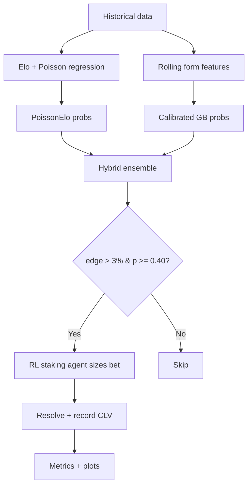

# Model Architecture

The project is a three-layer quantitative sports-betting pipeline.

## Layer 1 — Poisson + Elo hybrid (`models/poisson_elo_model.py`)

- **Elo ratings** give each team a dynamic strength score, updated sequentially
  match by match (`K = 20`, base `1500`). Elo attached to match *i* only uses
  matches `0..i-1` — no look-ahead.
- **Two Poisson regressions** (`statsmodels`) model expected home/away goals as
  a function of the two Elo ratings. Home advantage is captured by the fitted
  intercept (applying it a second time in `predict` was a bug that
  systematically inflated P(home win) — fixed).
- The **score grid** `P(h) × P(a)` for 0–8 goals is summed into
  `P(home win)`, `P(draw)`, `P(away win)`.
- Probabilities convert to **fair odds**; **edge** = `p × bookie_odds − 1`.

## Layer 2 — Gradient Boosting ML (`models/ml_layer.py`)

- Features: `home_elo`, `away_elo`, plus **shifted** rolling 5-match goal
  averages (the shift prevents a match's own goals leaking into its features).
- `GradientBoostingClassifier` wrapped in `CalibratedClassifierCV` (sigmoid,
  3-fold) — raw tree ensembles give extreme probabilities, and edge
  calculation is extremely sensitive to miscalibration.
- Team-aware prediction: at inference the model receives the *actual* Elo of
  both teams and their stored form (the original code fed constant
  placeholders, which made the model unable to distinguish teams — fixed).

## Layer 3 — Q-Learning staking agent (`models/rl_staking_agent.py`)

- **State** = (edge bin, bankroll-fraction bin) on a 10×10 grid.
- **Action** = Kelly multiplier ∈ {0, 0.5, 1.0, 1.5}×.
- **Reward** = realized fractional bankroll change.
- Trained only on the **validation** split's realized bets (no test leakage).
  Kelly multipliers (rather than absolute stake %s) keep stakes near the
  principled Kelly baseline and prevent the over-staking of the original code.

## Ensemble & backtest (`pipeline.py`)

```
Input (synthetic world or football-data.co.uk CSV)
  ↓
Preprocessing: date sort, Elo features, shifted form features
  ↓
Train / validation / test split (65 / 15 / 20, chronological)
  ↓
Layer 1: PoissonElo            Layer 2: ML (calibrated GB)
  ↓                                    ↓
        Hybrid ensemble p = (p₁ + p₂) / 2
  ↓
Edge = p × odds − 1   →   bet if edge > 3%, odds ≥ 1.6, p ≥ 0.40
  ↓
Layer 3: RL agent sizes the stake (fallback quarter-Kelly)
  ↓
Resolve vs recorded result → CLV = (closing − taken) / taken
  ↓
Metrics (ROI, Sharpe, max DD, profit factor, CLV) + charts + CSVs
```



## Deep-learning layers (optional)

- **PyTorch MLP** (`models/nn_model.py`) — 4 engineered features (home/away
  Elo + rolling form) → 64 → 64 → 3 softmax; z-scored features fitted on the
  training split only; fixed seed. Same API as the sklearn layer.
- **TensorFlow hybrid** (`models/tf_hybrid.py`) — an MLP whose input
  concatenates the 4 features with the PoissonElo model's probability outputs
  (3 numbers), so the net learns how to *adjust* the statistical model from
  the feature evidence.

Both are trained on all data and evaluated for cross-league transfer on real
La Liga / Premier League matches (`scripts/04_deep_learning_transfer.py`). The
experiment shows simple tree/linear models generalise out-of-distribution
better than the deep nets, and that real data is required to approach the
market (`docs/04_deep_learning_transfer.md`).

## Real-data evaluation (`scripts/05_season_backtest.py`)

- Expanding-window, season-by-season backtest on real La Liga
  (2021/22 → 2025/26): every test season is genuinely unseen.
- Online features: for match *i*, running Elo + last-5 rolling form from
  matches strictly before *i* — zero future leakage.
- Models: majority, PoissonElo, Ridge, Gradient Boosting, Random Forest;
  scored on accuracy, balanced accuracy, log-loss, Brier and ECE.
- Cross-league transfer tests (La Liga ↔ Premier League).

## World model (`pipeline.generate_match_data`)

The synthetic world is deliberately *calibrated*:

- 10 teams with latent strength `s ~ N(0,1)`; goals ~ Poisson with home
  advantage; results follow.
- Bookmaker odds = fair odds from the *true* probabilities × margin
  (`~U(5%, 8%)`) × the favourite–longshot bias (`p_bookie ∝ p_true^0.88`) —
  a well-documented real market phenomenon.
- Closing odds are drawn independently (smaller noise) so **CLV** is
  meaningful and centred near zero.
